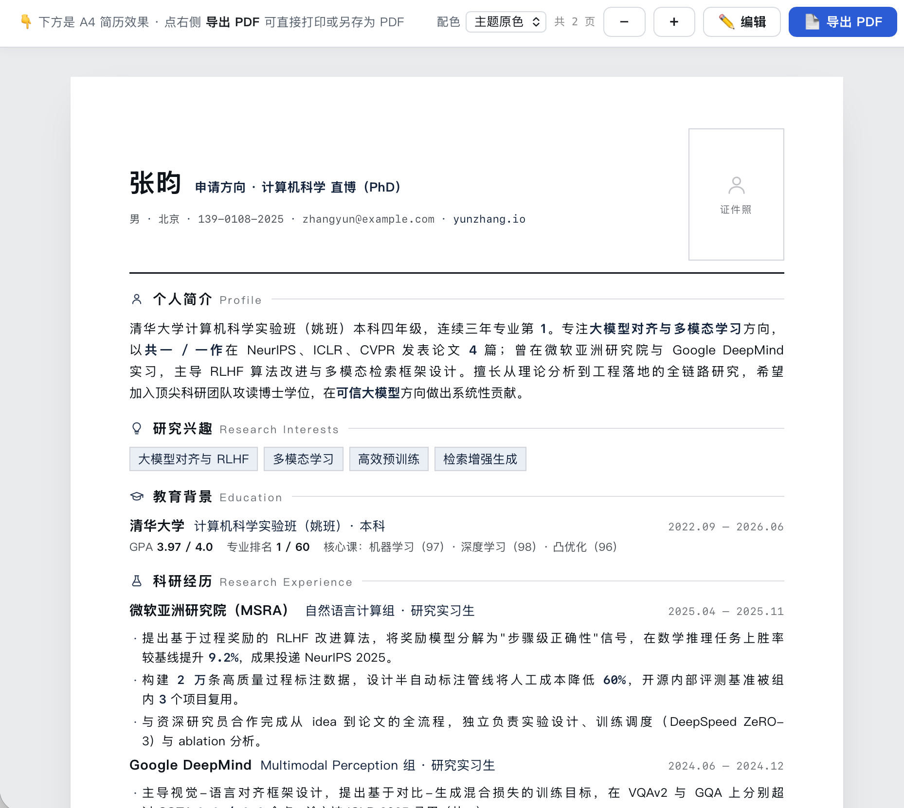
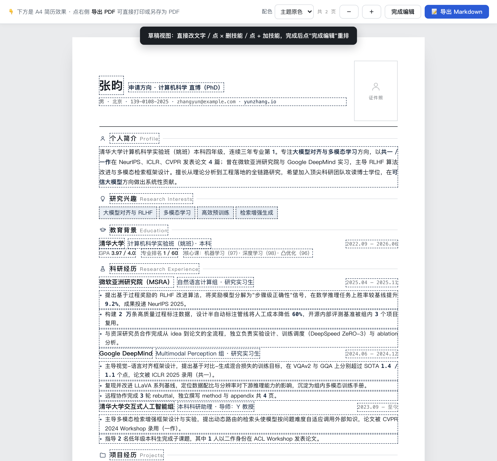
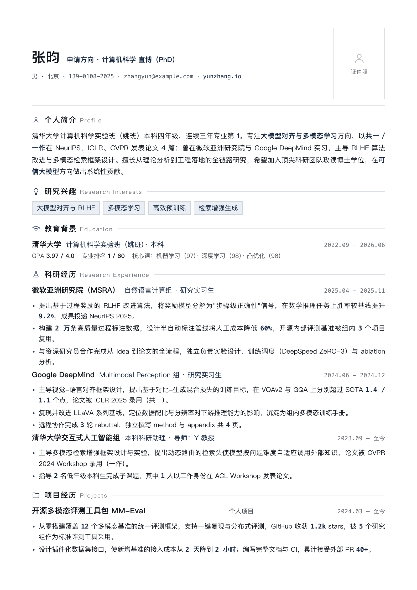
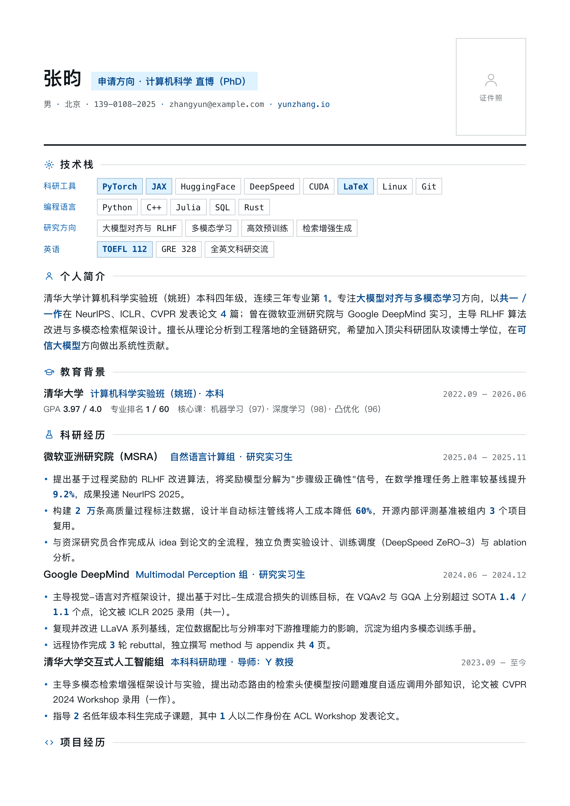
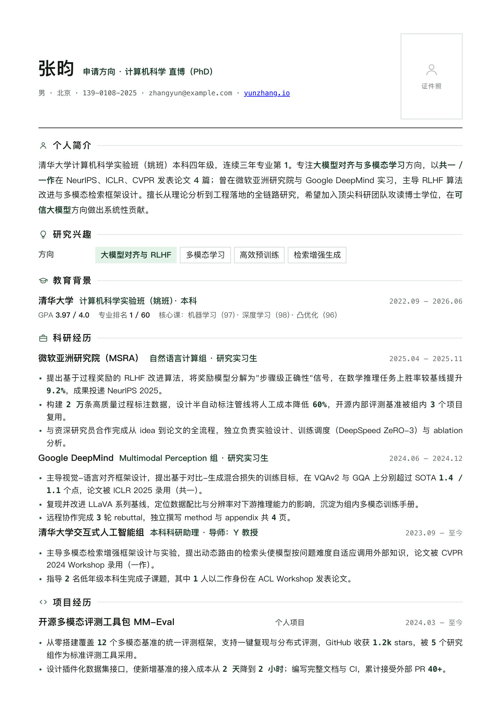
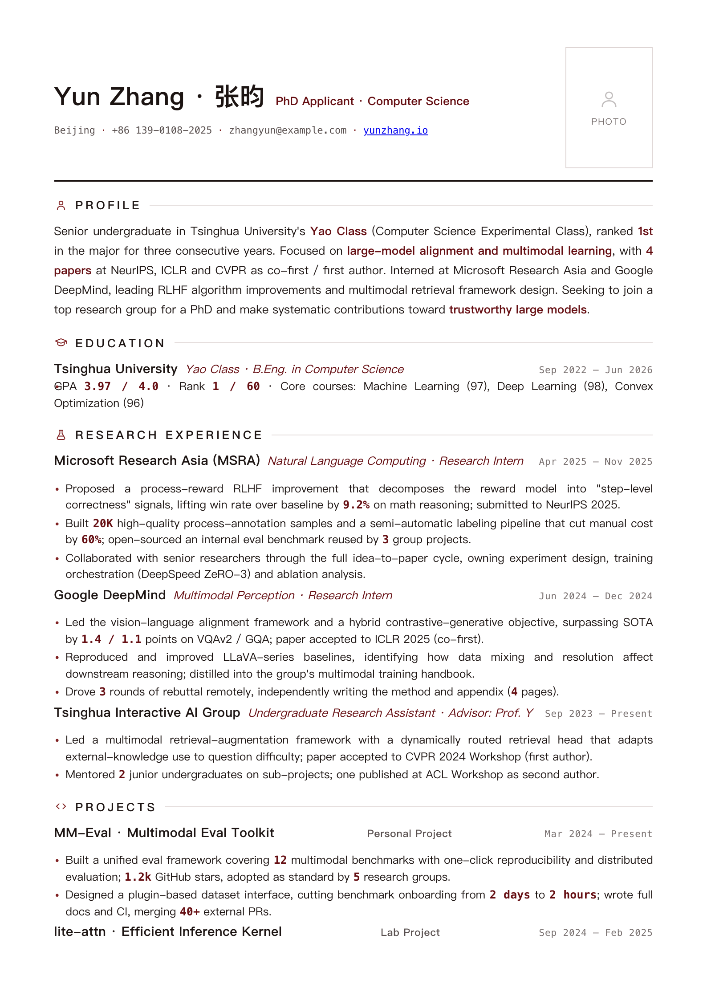
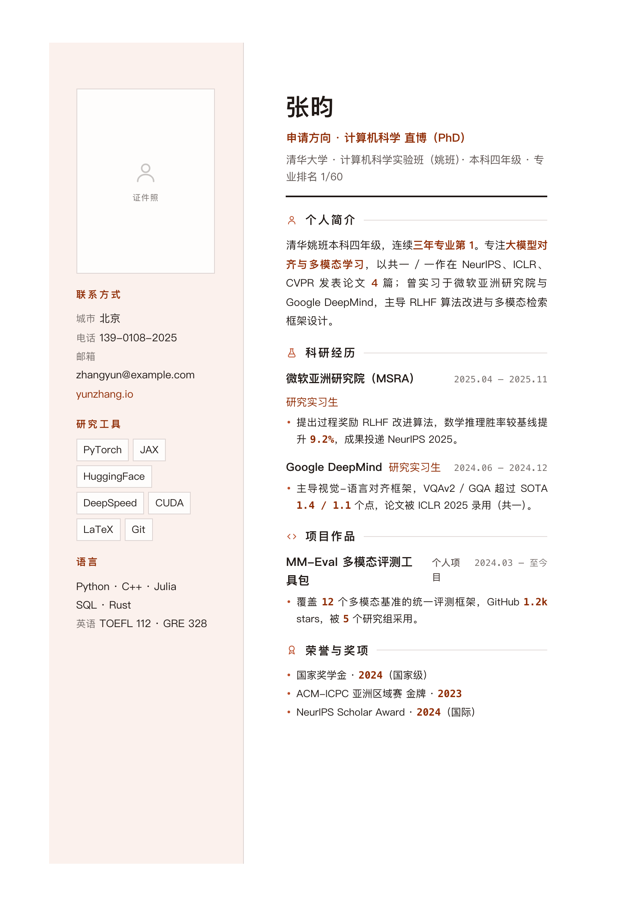
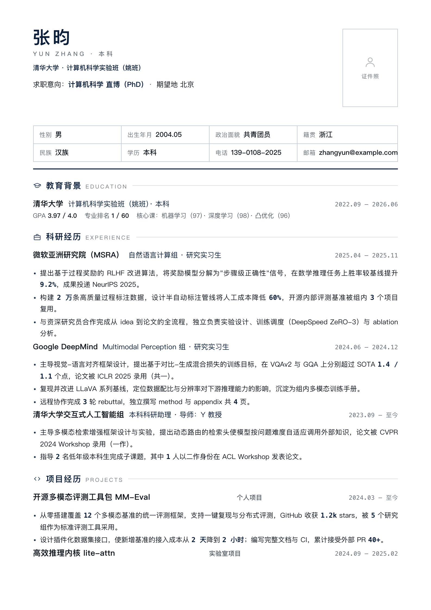
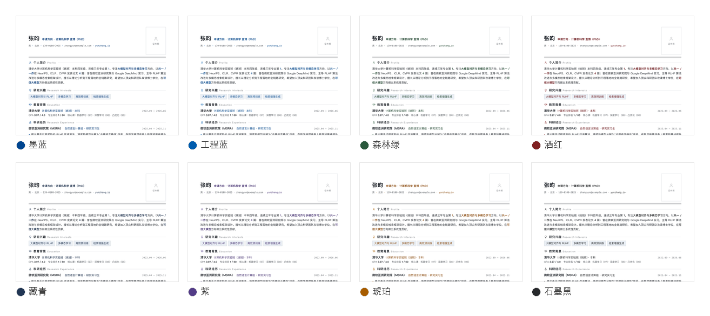

# amlei-resume

一个陪你把简历从头做到底的 [Agent Skill](https://agentskills.io)——从挖素材、写改简历，到导出 A4 PDF、生成招聘平台招呼语，全程像在跟一个懂行的朋友聊天。

可在 Claude Code、Cursor、Codex、Gemini CLI、OpenCode、Copilot 等工具里使用。

## 效果预览

写一份普通 Markdown，直接渲染成矢量 A4 简历——所见即所得。下面是一份样例（[完整源文件 `sample-resume.md`](skills/amlei-resume/assets/sample-resume.md)）导出后的效果：





> 也想看 PDF 版？打开 [A4 预览 PDF](assets/张昀-计算机科学直博%20·%20简历%20A4%20预览.pdf)（GitHub 内置阅读器直接查看）。

源文件就是这样的 Markdown：

```md
# self-intro

name: 张昀
role: 申请方向 · 计算机科学 直博（PhD）
avatar:

# 个人简介

清华大学计算机科学实验班（姚班）本科四年级……

# 科研经历

## 微软亚洲研究院（MSRA） | 自然语言计算组 · 研究实习生
date: 2025.04 — 2025.11

- 提出基于过程奖励的 RLHF 改进算法，将奖励模型分解为"步骤级正确性"信号……
```

模块顺序即简历顺序，写完选主题、一键导出 PDF。

<!-- 6 套主题一览：同一份 sample-resume 换皮（每主题第 1 页） -->
| 学术 / 科研 | 技术密排 | 内容运营 |
|:--:|:--:|:--:|
|  |  |  |

| 外企 / 英文 | 侧栏创意 | 国企 / 正式 |
|:--:|:--:|:--:|
|  |  |  |

> 想看整页？逐个打开各主题的完整预览：[学术 / 科研](assets/theme-samples/academic.html) · [技术密排](assets/theme-samples/tech-dense.html) · [内容运营](assets/theme-samples/content-green.html) · [外企 / 英文](assets/theme-samples/english-mnc.html) · [侧栏创意](assets/theme-samples/sidebar-creative.html) · [国企 / 正式](assets/theme-samples/soe-formal.html)

同一份简历还能一键切换 **8 套点缀配色**——预览页「配色」下拉选好，导出 PDF 沿用：



## 它解决什么问题

写简历的痛苦通常是三件：

- **每次换岗位都得重写一遍**——后端、AI Agent、全栈各投一份，内容打架。
- **做过的事自己都记不全**——几年下来哪些算亮点、哪些数字值得写，全凭印象。
- **导出成 PDF 还要折腾排版**——Word 排到崩溃，在线模板千篇一律。

amlei-resume 的思路是：**你只管聊你做过什么，剩下的交给它。**

- 你说过一次的事，它跨会话都记得——下次来不用从头讲。
- 同一份经历，自动投影出不同岗位方向的简历，不用一遍遍重写。
- 聊完直接导出矢量 A4 PDF，6 套主题任选，浏览器一键打印。
- 连招聘平台（Boss 直聘等）开场怎么打招呼，都给你备好几版。

## 你能做什么

| 想做的事 | 怎么用 |
|---------|--------|
| 导入现有简历 | 丢一份 `.docx` / `.pdf` 旧简历进来，自动解析、重排模块、抽出证件照，转成可继续改的结构化简历 |
| 从零写一份简历 | 丢给它项目资料 / 链接，它帮你挖亮点、组织成稿 |
| 改现有简历 | 把现版丢进来，告诉它哪儿不满意，逐节迭代 |
| 换岗位方向 | 基于已有经历重新选材，投影出一份新方向的简历 |
| 导出 A4 PDF | 选主题，装配 HTML，浏览器「导出 PDF」即得矢量成片 |
| 改渲染好的简历 | 装配出的 HTML 可在浏览器就地编辑：改字、点 × / + 删加技能条，完成自动重排分页，还能一键导回 Markdown |
| 了解岗位行情 | 给岗位 + 城市，拉一份市场报告（薪资 / 能力要求 / 技术栈） |
| 写招聘平台招呼语 | 简历定稿后自动产出 3–5 条不同方向的开场白 |
| 让它记住你 | 聊到的经历 / 项目 / 能力会沉淀成你的长期档案 |

## 快速上手

**1. 安装**

不同 agent 安装方式不同，按你用的工具来（以 Claude Code 为例）：

```sh
claude plugin add amlei/amlei-resume
```

Cursor / Codex / Gemini CLI / OpenCode 等的安装方式见各工具文档，skill 本体是同一份。

**2. 说清你想被怎样看见**

写简历，其实是在回答一个问题：你想被怎样看见？

简历不只是做过的事的罗列——它是你梳理自己、认识自己的过程，也是你留给面试官的第一印象。同样一段经历，换个方向就是另一种讲法；你要决定的，只是这一份要让对方看见哪一面。

而这些，你只需要跟 AI 说清楚：**目标方向**是什么、**手上有哪些经历和能力**、**这份简历想突出哪一面**（也可以直接丢一份旧简历或项目链接）。剩下的事——挖亮点、选材、重写、评估、导出——它会带着你一步一步打磨出来，像跟一个懂行的朋友反复推敲。

**更建议先把能想到的一次说全**——目标、方向、经历、材料来源都交代清楚，它就能照着这个画像开工：

> 我是 2026 届应届生，有一年实习经验，想找深圳的 AI Agent / AI 应用岗位，期望月薪 13–16k。现有简历想往 AI Agent 方向靠一靠，再补几个个人项目，把实习经历和公司项目梳理清楚。我的博客和 GitHub 在这里；公司项目具体做了什么，飞书知识库和开发机上都有记录，需要随时给你看。

说漏了也没关系。剩下的细节，是边聊边补出来的——使用这个 skill 就像跟人聊天，很多你坐在那儿主动想都想不出来的细节，聊着聊着就冒出来了；不光是项目和成果，连"原来我也挺能干的"这点信心，常常也是聊出来的。

只想轻量起步也行，一句话就能开干——

- 「做了三年后端，想转 AI Agent 方向，这是我的旧简历，帮我重新讲一版。」
- 「这份简历的项目太单薄，想突出技术深度和量化成果，帮我改这几条。」
- 「简历定稿了，导出 A4 PDF，再帮我写几条 Boss 直聘的开场白。」

全程人工卡点：每一步要什么资料、在哪确认，都会先问你；**你没说"可以"之前，它不会动你的文件**。

## 四个 skill 怎么分工

| skill | 角色 |
|-------|------|
| `amlei-profile` | **你的长期记忆**——身份 / 经历 / 项目 / 能力，跨会话沉淀，独立于任何具体岗位 |
| `amlei-resume` | **简历工作台**——写 / 改 / 换岗 / 评估 / 导出，消费 profile 投影成具体方向的简历 |
| `amlei-text-polish` | **文字打磨**——逐行润色，在不改原意的前提下让表达更清晰有力 |
| `amlei-job-market-research` | **市场侦察**——拉指定岗位和城市的就业市场情报 |

> 想 diy 或看内部机制，每个 skill 的 `SKILL.md` 和 `references/` 里有完整说明。
